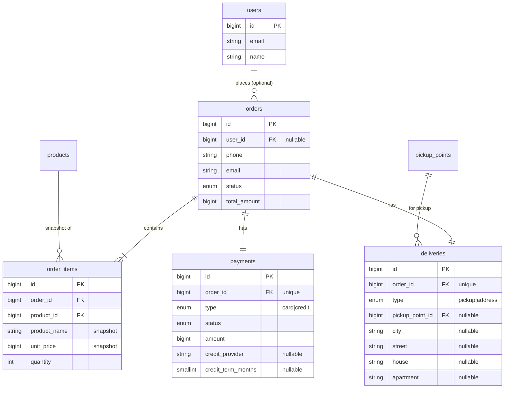
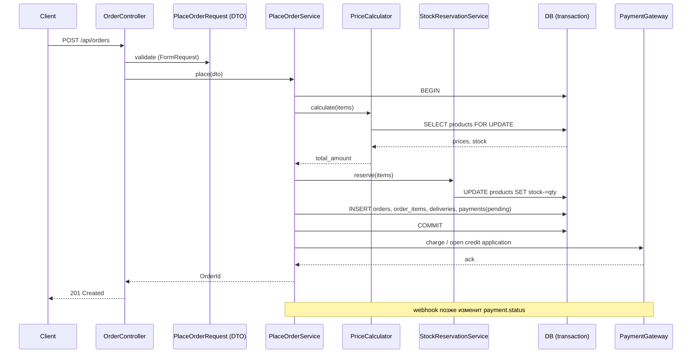

# Fhtagn! Studio — тестовое задание

Проектирование структуры данных и логики оформления заказа для интернет-магазина.

**Стек ориентира:** PHP 8 / Laravel 11 / MySQL 8.

---

## 1. Решения и обоснования

### 1.1. Полиморфные сущности (доставка, оплата) — Single Table с дискриминатором

Для каждой из этих сущностей рассмотрены три варианта:

| Подход | Плюсы | Минусы |
|---|---|---|
| **Single Table (STI)** — одна таблица, колонка `type`, специфические поля nullable | Один JOIN, проще запросы, проще миграции | Часть колонок всегда NULL, валидация на уровне приложения |
| **Class Table Inheritance** — родительская + по таблице на тип | Чистая нормализация, NOT NULL для специфических полей | Больше JOIN'ов, сложнее добавлять тип |
| **Polymorphic morphTo (Laravel)** — отдельная таблица на тип + связь по `*_type/*_id` | Каждый тип — свой агрегат, свои поля и правила | Нет FK constraint'а на полиморфную связь, сложнее аналитика |

**Выбираю Single Table** для обеих сущностей: типов всего 2, специфических полей мало (1 для самовывоза, 4 для адреса; 0 для карты, 2 для кредита), приложение всё равно маршрутизирует по типу. Расширение на новый тип — миграция с nullable полями + класс-обработчик. Если в будущем типов станет 5+ или у одного из них появятся свои дочерние сущности — мигрируем на CTI или морф.

### 1.2. Снимки данных в `order_items`

Цены и название товара пишем в `order_items` копией. Иначе изменение цены товара после оформления заказа изменит историческую сумму заказа — это баг.

### 1.3. Деньги — целые числа в минорных единицах

Все суммы (цена позиции, сумма заказа, сумма платежа) — `BIGINT` в минорных единицах валюты. Хранение в `DECIMAL` тоже допустимо, но `BIGINT` исключает любую неточность арифметики и быстрее.

### 1.4. Гость vs зарегистрированный пользователь

`orders.user_id` — nullable (FK на `users`). Если пользователь не залогинен — заказ привязывается только по контактам (`phone`, `email`); их же сохраняем и для зарегистрированного пользователя как «контакты на этот заказ» (могут отличаться от профиля).

### 1.5. Статусы

- `orders.status`: `created → confirmed → paid → shipped → delivered → completed` + `cancelled`. ENUM.
- `payments.status`: `pending → authorized → captured → failed → refunded`. ENUM.
- Жизненные циклы независимы: заказ оформлен — не значит оплачен.

---

## 2. Структура БД

### Таблицы

**`users`** — справочник, упрощённо.
- `id`, `email`, `name`, `created_at`

**`products`** — справочник, упрощённо.
- `id`, `sku`, `name`, `price` (BIGINT), `is_active`, `stock`

**`pickup_points`** — пункты выдачи.
- `id`, `code`, `address`, `is_active`

**`orders`** — корневая сущность заказа.
- `id` BIGINT PK
- `user_id` BIGINT NULL FK → `users.id`
- `phone` VARCHAR(20) NOT NULL
- `email` VARCHAR(255) NOT NULL
- `status` ENUM NOT NULL DEFAULT `'created'`
- `total_amount` BIGINT NOT NULL — сумма по всем позициям
- `created_at`, `updated_at`
- Индексы: `(user_id)`, `(email)`, `(status, created_at)`

**`order_items`** — позиции заказа со снимком данных.
- `id`, `order_id` FK → `orders.id` ON DELETE CASCADE
- `product_id` FK → `products.id` (RESTRICT — товар нельзя удалить, если он в заказе)
- `product_name` VARCHAR(255) — снимок названия
- `unit_price` BIGINT — снимок цены
- `quantity` INT
- `line_total` BIGINT (generated column: `unit_price * quantity`)
- Уник: `(order_id, product_id)` — одна строка на товар; кратность через `quantity`

**`deliveries`** — Single Table.
- `id`, `order_id` FK UNIQUE (one-to-one)
- `type` ENUM(`'pickup'`, `'address'`) NOT NULL
- `pickup_point_id` FK NULL → `pickup_points.id` — обязательно для `pickup`
- `city`, `street`, `house`, `apartment` VARCHAR NULL — обязательны для `address` (apartment может быть пустым)
- CHECK constraint:
  ```
  (type='pickup'  AND pickup_point_id IS NOT NULL AND city IS NULL)
  OR
  (type='address' AND pickup_point_id IS NULL AND city IS NOT NULL AND street IS NOT NULL AND house IS NOT NULL)
  ```

**`payments`** — Single Table.
- `id`, `order_id` FK UNIQUE
- `type` ENUM(`'card'`, `'credit'`)
- `status` ENUM
- `amount` BIGINT
- `credit_provider` VARCHAR(100) NULL — обязателен для `credit`
- `credit_term_months` SMALLINT NULL — обязателен для `credit`
- `external_id` VARCHAR — id у провайдера (для card; для credit — заявка)
- CHECK constraint аналогично доставке

### ER-диаграмма



---

## 3. Декомпозиция приложения

Слои (ADR-подобный подход на Laravel):

```
app/
├── Http/
│   └── Controllers/
│       └── OrderController.php          ← тонкий: HTTP → DTO → Service
├── Domain/
│   ├── Order/
│   │   ├── Order.php                     ← модель/агрегат
│   │   ├── OrderItem.php
│   │   ├── OrderStatus.php               ← enum
│   │   └── Repositories/
│   │       └── OrderRepository.php
│   ├── Delivery/
│   │   ├── Delivery.php                  ← модель (STI)
│   │   ├── DeliveryType.php              ← enum
│   │   ├── DeliveryDataInterface.php     ← маркерный
│   │   ├── PickupDeliveryData.php        ← VO/DTO
│   │   └── AddressDeliveryData.php       ← VO/DTO
│   └── Payment/
│       ├── Payment.php
│       ├── PaymentType.php
│       ├── PaymentStatus.php
│       ├── PaymentDataInterface.php
│       ├── CardPaymentData.php
│       └── CreditPaymentData.php
├── Application/
│   └── Order/
│       ├── DTO/
│       │   └── PlaceOrderRequest.php     ← входной DTO с дискриминаторами
│       ├── PlaceOrderService.php         ← главный сценарий
│       ├── PriceCalculator.php
│       └── StockReservationService.php
└── Infrastructure/
    └── Payment/
        ├── PaymentGatewayInterface.php
        └── (реализации провайдеров)
```

**Зоны ответственности:**

- **Controller** — принимает HTTP, валидирует через FormRequest, собирает `PlaceOrderRequest` DTO, вызывает `PlaceOrderService`, отдаёт ответ. Не знает про БД и про логику.
- **PlaceOrderService** — оркестратор. Не содержит SQL, координирует доменные объекты, открывает транзакцию.
- **OrderRepository** — единственное место, которое знает про SQL. Возвращает Order-агрегаты.
- **PriceCalculator** — пересчитывает суммы с учётом цен из БД (а не из запроса!).
- **StockReservationService** — резерв остатков. Атомарно списывает в той же транзакции.
- **PaymentGateway** — внешняя интеграция. Никогда не вызывается внутри транзакции БД (внешний вызов после commit).

---

## 4. Базовая логика оформления

### Что приходит на вход

```json
{
  "user_id": 42,
  "phone": "+7XXXXXXXXXX",
  "email": "user@example.com",
  "items": [
    { "product_id": 1, "quantity": 2 },
    { "product_id": 5, "quantity": 1 }
  ],
  "delivery": {
    "type": "address",
    "city": "Бишкек",
    "street": "Чуй",
    "house": "10",
    "apartment": "5"
  },
  "payment": {
    "type": "credit",
    "credit_provider": "Halyk",
    "credit_term_months": 12
  }
}
```

### Проверки

1. **Валидация формата** (FormRequest):
   - email/phone — формат
   - items — непустой массив, qty ≥ 1
   - delivery.type ∈ {pickup, address}, payment.type ∈ {card, credit}
   - условные required-поля по дискриминатору
2. **Доменная валидация** (Service):
   - все `product_id` существуют и активны
   - остатков хватает на запрошенное количество
   - для `pickup` — `pickup_point_id` существует и активен
   - если `user_id` указан — он существует
   - для `credit` — провайдер из whitelist'а, срок ≤ N

### Порядок сохранения (внутри одной БД-транзакции)

```
BEGIN
  1. Загружаем актуальные цены и остатки через SELECT ... FOR UPDATE на products
     (защита от race: одновременные заказы того же товара)
  2. Если остатков не хватает → ROLLBACK + ошибка
  3. INSERT orders (status='created', total_amount=рассчитан на сервере)
  4. INSERT order_items (со снимками unit_price/product_name)
  5. UPDATE products SET stock = stock - qty
  6. INSERT deliveries (по типу)
  7. INSERT payments (status='pending')
COMMIT

8. После коммита: запрос в платёжный шлюз / заявка в кредит
9. По ответу шлюза — обновляем payments.status и orders.status
   (через webhook или поллинг — отдельный сценарий)
```

### Ключевой принцип

**Цены и итоговая сумма всегда пересчитываются на сервере** из актуальных `products.price` × `qty`. Сумму, пришедшую с клиента, игнорируем — она нужна только для контрольной сверки на UI.

---

## 5. Sequence-диаграмма оформления



---

## 6. Расширение

- **Новый тип доставки** (например, курьер с временным окном) — миграция: новый литерал в ENUM `type` + nullable колонки + новый `*DeliveryData` + ветка в обработчике. Существующие данные не трогаем.
- **Новый способ оплаты** (СБП, рассрочка) — аналогично.
- **Промокоды/скидки** — отдельная таблица `order_discounts` (one-to-many с `orders`), `total_amount` остаётся итоговой суммой к оплате.
- **Несколько платежей за один заказ** (частичная оплата) — снимаем `UNIQUE` с `payments.order_id`, добавляем `payments.applied_amount`.
- **Резервирование стока без списания** — отдельная таблица `stock_reservations` с TTL вместо `UPDATE products.stock`. Полезно, когда заказ оформляется, но пока не оплачен.